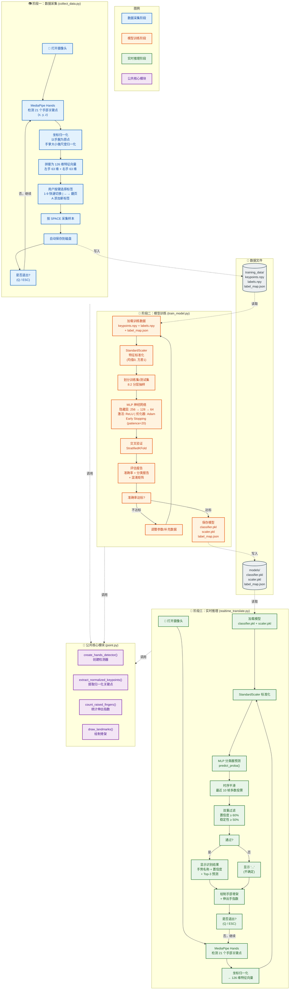

# 手语识别系统 — 整体流程图

```mermaid
flowchart TB
    subgraph LEGEND[" 图例 "]
        direction LR
        L1[数据采集阶段]:::phase1
        L2[模型训练阶段]:::phase2
        L3[实时推理阶段]:::phase3
        L4[公共核心模块]:::phase4
    end

    %% ============================================
    %% 阶段1: 数据采集
    %% ============================================
    subgraph P1["📷 阶段一：数据采集 (collect_data.py)"]
        direction TB
        A1["🎥 打开摄像头"]:::phase1
        A2["MediaPipe Hands<br/>检测 21 个手部关键点<br/>(x, y, z)"]:::phase1
        A3["坐标归一化<br/>以手腕为原点<br/>手掌大小做尺度归一化"]:::phase1
        A4["拼接为 126 维特征向量<br/>左手 63 维 + 右手 63 维"]:::phase1
        A5["用户按键选择标签<br/>1-9 快速切换 | ←→ 翻页<br/>A 添加新标签"]:::phase1
        A6["按 SPACE 采集样本"]:::phase1
        A7["自动保存到磁盘"]:::phase1
        A8["是否退出?<br/>(Q / ESC)"]:::phase1

        A1 --> A2 --> A3 --> A4 --> A5 --> A6 --> A7 --> A8
        A8 -->|"否，继续"| A2
    end

    %% ============================================
    %% 阶段2: 模型训练
    %% ============================================
    subgraph P2["🧠 阶段二：模型训练 (train_model.py)"]
        direction TB
        B1["加载训练数据<br/>keypoints.npy + labels.npy<br/>+ label_map.json"]:::phase2
        B2["StandardScaler<br/>特征标准化<br/>(均值0, 方差1)"]:::phase2
        B3["划分训练集/测试集<br/>8:2 分层抽样"]:::phase2
        B4["MLP 神经网络<br/>隐藏层: 256 → 128 → 64<br/>激活: ReLU | 优化器: Adam<br/>Early Stopping (patience=20)"]:::phase2
        B5["交叉验证<br/>StratifiedKFold"]:::phase2
        B6["评估报告<br/>准确率 + 分类报告<br/>+ 混淆矩阵"]:::phase2
        B7["准确率达标?"]:::phase2
        B8["保存模型<br/>classifier.pkl<br/>scaler.pkl<br/>label_map.json"]:::phase2
        B9["调整参数/补充数据"]:::phase2

        B1 --> B2 --> B3 --> B4 --> B5 --> B6 --> B7
        B7 -->|"达标"| B8
        B7 -->|"不达标"| B9 --> B1
    end

    %% ============================================
    %% 阶段3: 实时推理
    %% ============================================
    subgraph P3["🎯 阶段三：实时推理 (realtime_translate.py)"]
        direction TB
        C1["🎥 打开摄像头"]:::phase3
        C2["MediaPipe Hands<br/>检测 21 个手部关键点"]:::phase3
        C3["坐标归一化<br/>→ 126 维特征向量"]:::phase3
        C4["加载模型<br/>classifier.pkl + scaler.pkl"]:::phase3
        C5["StandardScaler 标准化"]:::phase3
        C6["MLP 分类器预测<br/>predict_proba()"]:::phase3
        C7["时序平滑<br/>最近 10 帧多数投票"]:::phase3
        C8["双重过滤<br/>置信度 ≥ 60%<br/>稳定性 ≥ 50%"]:::phase3
        C9["通过?"]:::phase3
        C10["显示识别结果<br/>手势名称 + 置信度<br/>+ Top-3 预测"]:::phase3
        C11["显示 '...'<br/>(不确定)"]:::phase3
        C12["绘制手部骨架<br/>+ 伸出手指数"]:::phase3
        C13["是否退出?<br/>(Q / ESC)"]:::phase3

        C1 --> C2 --> C3 --> C5 --> C6 --> C7 --> C8 --> C9
        C4 --> C5
        C9 -->|"是"| C10 --> C12 --> C13
        C9 -->|"否"| C11 --> C12
        C13 -->|"否，继续"| C2
    end

    %% ============================================
    %% 阶段4: 公共核心模块
    %% ============================================
    subgraph P4["🔧 公共核心模块 (point.py)"]
        direction LR
        D1["create_hands_detector()<br/>创建检测器"]:::phase4
        D2["extract_normalized_keypoints()<br/>提取归一化关键点"]:::phase4
        D3["count_raised_fingers()<br/>统计伸出指数"]:::phase4
        D4["draw_landmarks()<br/>绘制骨架"]:::phase4
    end

    %% ============================================
    %% 数据文件
    %% ============================================
    subgraph DATA["📁 数据文件"]
        direction LR
        F1[("training_data/<br/>keypoints.npy<br/>labels.npy<br/>label_map.json")]:::data
        F2[("models/<br/>classifier.pkl<br/>scaler.pkl<br/>label_map.json")]:::data
    end

    %% ============================================
    %% 阶段之间的连接
    %% ============================================
    A7 -.->|"写入"| F1
    F1 -.->|"读取"| B1
    B8 -.->|"写入"| F2
    F2 -.->|"读取"| C4

    P1 -.->|"调用"| P4
    P2 -.->|"调用"| P4
    P3 -.->|"调用"| P4

    %% ============================================
    %% 样式
    %% ============================================
    classDef phase1 fill:#E3F2FD,stroke:#1565C0,stroke-width:2px,color:#0D47A1
    classDef phase2 fill:#FFF3E0,stroke:#E65100,stroke-width:2px,color:#BF360C
    classDef phase3 fill:#E8F5E9,stroke:#2E7D32,stroke-width:2px,color:#1B5E20
    classDef phase4 fill:#F3E5F5,stroke:#7B1FA2,stroke-width:2px,color:#4A148C
    classDef data  fill:#ECEFF1,stroke:#455A64,stroke-width:2px,color:#263238
    classDef subgraphTitle fill:none,stroke:none,font-weight:bold,font-size:14px
```

---

